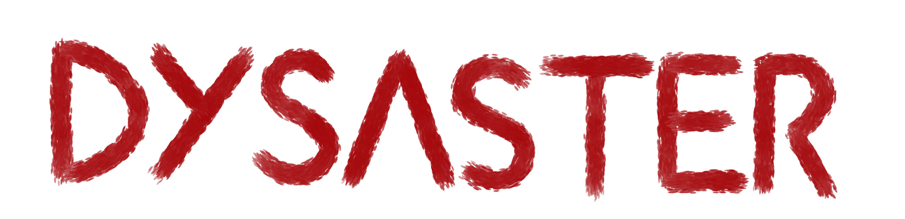
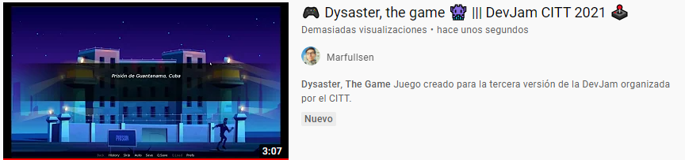

  

<h3 align="center">Dysaster The Game</h3>

 Novela visual creada para participar en la <i>Tercera DevJam DuocUC 2021</i>.
      

  

## 📝 Contenidos

- [¿Qué es Dysaster?](#demo)
- [Categorías](#categorias)
- [Limitaciones](#limitations)
- [Planes a futuro](#future_scope)
- [Lanzando el juego](#getting_started)
- [Configurando la dev](#dev)
- [Jugar la versión oficial](#usage)
- [Tecnologías](#tech_stack)
- [Autores](#authors)
- [Agradecimientos](#acknowledgments)

## 💡 ¿Qué es Dysaster? 

Dysaster es una novela visual (tambien llamado _juego de decisiones_), con la que participamos en el evento organizado por el Citt llamado "DevJam",
en este evento los estudiantes de diversas carreras presentan todo tipo de juegos, personajes, ideas, etc.

## 🏁 Sobre nuestro team

Conformamos un equipo de 5 integrantes, y decidimos inscribirnos en la categoría *demo*.
Usando el motor de novelas visuales llamado [RenPy](https://www.renpy.org/), creamos este juego de decisiones llamado __Dysaster__.

## 🧐 Categorías 

La DevJam fue organizada por el [CTTT](https://beacons.page/citt.duocuc), en [las bases del concurso](https://docs.google.com/document/d/1vkKhEZsnZai61lMFDaIjd1TNPfzA5MK7DmYnEyKL26g) se especifica que existen tres caterogías:
- GOTY: Por sus siglas en inglés, "Game of the year", juego del año, donde participan juegos de primera categoría.
- Demo: Al menos un nivel del juego.
- Crea tu personaje: Se dibuja un personaje y se presenta para el concurso.

Además de esto, se hará una premiación del juego más votado.
## ⛓️ Limitaciones 

El juego está limitado al primer nivel.
Los contenidos presentados podrían variar considerablemente a través del tiempo en futuras versiones.

## 🚀 Planes a futuro 

Se planea continuar con el desarrollo cambiando en un futuro el motor [RenPy](https://www.renpy.org/) por "Unity",
esto aún está en _veremos_ pues se está trabajando en la capacitación de los integrantes.

## 🏁 Lanzando el juego 

El juego usa el motor [RenPy](https://www.renpy.org/) para su desarrollo (basado en Python),
para la versión de producción se generó un archivo ejecutable que **No necesita Python**.

- Ver [versión de oficial](#usage)
- Ver [versión de desarrollo](#dev)

### Requisitos Previos

Para la versión oficial sólo es necesario descargar el ejecutable oficial.

Para la versión de desarrollo se necesita **[RenPy](https://www.renpy.org/)**

### Configurando la versión de desarrollo  

- Ya instalado [RenPy](https://www.renpy.org/) se procede a descargar este repositorio
- En caso de descargar comprimido, **se debe extraer dentro de una carpeta**.
- Corroborar que dentro de la carpeta existe una carpeta llamada **game**
- Ir a la ruta de RenPy.exe y dejar la carpeta al mismo nivel.
- Ejecutar el RenPy, en caso de ya estar ejecutado, hacer click en _Refresh_.
- Hacer click al juego y luego hacer click a _Launch game_
- Perfecto, el juego se está ejecutando tal y cómo se hacía en la fase de desarrollo.

- Para hacer modificaciones ir a la carpeta que añadimos y modificar los archivos de la carpeta _game_
- Desde el menú que entrega RenPy al buscar el juego también es posible abrir los archivos para edición.

## 🎈 Jugar la versión oficial 

La versión oficial puede [descargarse aquí desde la release oficial en Github](https://github.com/Marfullsen/dysaster-the-game/releases/download/v0.1'/Dysaster-Demo.0.1.zip).

También está disponible en [Mega haciendo click aquí](https://mega.nz/file/hwsmiLLZ#a0zaN0IOcbFtz6-nyeobp5S1ET0ZO6kWOfkqQs8ltl0).

## ⛏️ Tecnologías usadas 

- [RenPy](https://www.renpy.org/) - Motor para crear novelas visuales (Juegos de decisiones).

## ✍️ Autores 

- [@TheHasen](https://github.com/TheHasen) - Historia, diálogos, ideas y diseño.
- [@Marfullsen](https://github.com/Marfullsen) - Programación y diseño UI/UX.
- [@OcikoTorzido](https://github.com/Ocikotorzido) - Dibujos, bocetos, generar ideas.
- [@GustavoNeiraGonzalez](https://github.com/GustavoNeiraGonzalez) - Generar ideas.
- [@alvmoralesm](https://github.com/alvmoralesm) - Generar ideas.

## 🎉 Agradecimientos, referencias y menciones 

- Organizadores del evento.
  - Julio Herrera
  - Vanessa Sáez

- [Freepik](https://www.freepik.com/free-photos-vectors/)
- [Documentación oficial de RenPy](https://www.renpy.org/doc/html/index.html)