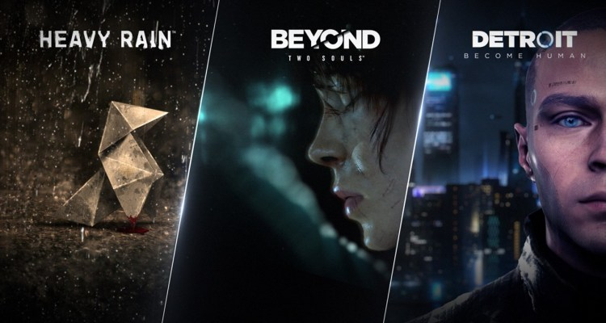

  

<h3 align="center">Dysaster The Game</h3>

 Novela visual ganadora del primer lugar de la <i>Tercera DevJam CITT DuocUC 2021</i>.
      

  

## 📝 Contenidos

- [¿Qué es Dysaster?](#demo)
- [Categorías](#categorias)
- [Limitaciones](#limitations)
- [Planes a futuro](#future_scope)
- [Lanzando el juego](#getting_started)
- [Configurando la dev](#dev)
- [Jugar la versión oficial](#usage)
- [Tecnologías](#tech_stack)
- [Banda sonora](#soundtrack)
- [Autores](#authors)
- [Agradecimientos](#acknowledgments)

## 💡 ¿Qué es Dysaster? 

Dysaster es una novela visual (_juego de decisiones_) estilo _survival_/terror, el cual se ambienta en un mundo azotado por una infección zombie.

## :detective: Trama 

Un peligroso criminal huye de una prisión de máxima seguridad, a medida que la trama avanza se irán sumando más personajes a la historia, juntos deberán sortear distintas dificultades en una odisea mientras tratan de sobrevivir.

## :shamrock: Participación en la _DevJam_

  

El juego participó en [la tercera _DevJam_](https://www.youtube.com/watch?v=Ko8Yl3dOhWQ) organizada por el CITT, dónde estudiantes de diversas carreras desarrollaron videojuegos.

## 🏁 Sobre nuestro team

Conformamos un equipo de 5 integrantes, y decidimos inscribirnos en la categoría *demo*, usando el motor de novelas visuales llamado [RenPy](https://www.renpy.org/), creamos este juego de decisiones llamado __Dysaster__.

## 🧐 Categorías 

La DevJam fue organizada por el [CTTT](https://beacons.page/citt.duocuc), en [las bases del concurso](https://docs.google.com/document/d/1vkKhEZsnZai61lMFDaIjd1TNPfzA5MK7DmYnEyKL26g) se especifica que existen tres caterogías:
- GOTY: Por sus siglas en inglés, "Game of the year", juego del año, donde participan juegos de primera categoría.
- Demo: Al menos un nivel del juego.
- Crea tu personaje: Se dibuja un personaje con una historia de fondo y se presenta para el concurso.

Además de esto, se hará una premiación del juego más votado.

## Crítica del jurado

El jurado se vió maravillado por el juego, según se aprecia en [el video del evento](https://youtu.be/Ko8Yl3dOhWQ?t=5383), les recordó juegos como _Heavy Rain_, _Beyond: Two Souls_ e incluso _Prison Break_ por el escape en la playa.

  

## ⛓️ Limitaciones 

El juego está limitado al primer nivel y los contenidos presentados en esta documentación podrían variar considerablemente a través del tiempo en futuras versiones.

**Spoiler**: hay un mapa [disponible aquí](./docs/img/renpy-graphviz-dysaster-0.1.png) con todos los escenarios disponibles en la versión 0.1, estos mapas pueden realizarse online con [Renpy Analyser](https://renpy.amethysts.studio/), también es posible descargar una (versión de terminal/consola)[https://github.com/EwenQuim/renpy-graphviz/releases/] para generar el mapa.

## 🚀 Planes a futuro 

Se planea continuar con el desarrollo cambiando en un futuro el motor [RenPy](https://www.renpy.org/) por [Unity](https://unity.com/), esto aún está en _veremos_ pues se está trabajando en la capacitación del equipo.

## 🏁 Desarrollo del juego 

El juego usa el motor [RenPy](https://www.renpy.org/) para su desarrollo (basado en [Python](https://www.python.org/)), sin embargo, ¡la versión oficial **No necesita Python**, llegar y jugar!

  

- Ver [versión de oficial](#usage)
- Ver [versión de desarrollo](#dev)

### Requisitos Previos

Para la versión oficial **sólo es bajar y jugar**.

Para la versión de desarrollo se necesita **[RenPy](https://www.renpy.org/)** para abrir el juego.

### Configurando la versión de desarrollo  

- Ya instalado [RenPy](https://www.renpy.org/) se procede a **descargar/clonar este repositorio**.
- En caso de descargar comprimido, **se debe extraer dentro de una carpeta**.
- Corroborar que dentro de la carpeta existe una carpeta llamada **game**
- Ir a la ruta de RenPy.exe y dejar la carpeta al mismo nivel.
- Ejecutar el RenPy, en caso de ya estar ejecutado, hacer click en _Refresh_.
- Hacer click al juego y luego hacer click a _Launch game_
- Perfecto, el juego se está ejecutando tal y cómo se hacía en la fase de desarrollo.

- Para hacer modificaciones ir a la carpeta que añadimos y modificar los archivos de la carpeta _game_
- Desde el menú que entrega RenPy al buscar el juego también es posible abrir los archivos para edición.

## 🎈 Jugar la versión oficial 

### La versión oficial puede descargarse [aquí](https://github.com/Marfullsen/dysaster-the-game/releases/download/v0.1b/Dysaster-0.1b-win.2.11.21.1.zip).

  

### También está disponible en [Mega](https://mega.nz/file/Zp8x3SaA#bpccNFgemFaHK1nMMg19tuw12__cEeAmmFEijNkA2M0).

  

## ⛏️ Tecnologías usadas 

- [RenPy](https://www.renpy.org/) - Motor para crear novelas visuales (Juegos de decisiones).

## :musical_score: Banda Sonora  

El Soundtrack del juego está disponible en formato mp3
- :microphone:	[main-menu-voice.mp3](./game/audio/main-menu-voice.mp3)
- :musical_note: [bg-theme.mp3](./game/audio/bg-theme.mp3)

## ✍️ Autores 

- :man_student: [@TheHasen](https://github.com/TheHasen) - Historia, diálogos, ideas y diseño.
- :man_student: [@Marfullsen](https://github.com/Marfullsen) - Programación y diseño UI/UX.
- :man_student: [@OcikoTorzido](https://github.com/Ocikotorzido) - Dibujos, bocetos, generar ideas.
- :man_student: [@GustavoNeiraGonzalez](https://github.com/GustavoNeiraGonzalez) - Generar ideas.
- :man_student: [@alvmoralesm](https://github.com/alvmoralesm) - Generar ideas.

## 🎉 Agradecimientos, referencias y menciones 

- Organizadores del evento.
  - :man_teacher: Julio Herrera
  - :woman_teacher: Vanessa Sáez
- :globe_with_meridians: [Freepik](https://www.freepik.com/free-photos-vectors/)
- :globe_with_meridians: [Documentación oficial de RenPy](https://www.renpy.org/doc/html/index.html)
- :globe_with_meridians: [Emojis para Github](https://github.com/ikatyang/emoji-cheat-sheet/blob/master/README.md)
- :globe_with_meridians: [Mapa de los niveles](https://renpy.amethysts.studio/)